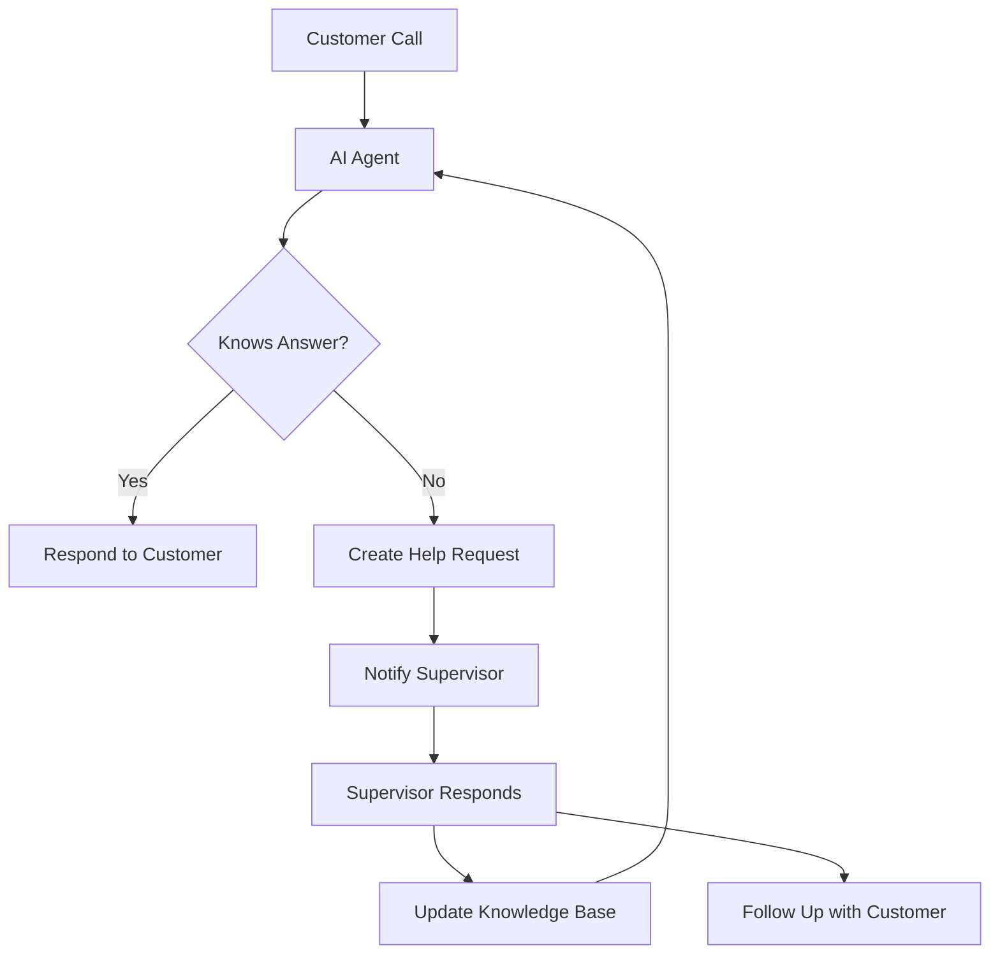

# Frontdesk Human-in-the-Loop AI Supervisor

This system enables AI agents to escalate queries to human supervisors when needed, learn from responses, and automatically follow up with customers.

## System Architecture



## Quick Start

### Prerequisites
- Node.js v14+
- Python 3.8+
- LiveKit account (free tier)
- OpenAI API key
- Firebase account (free tier)

### Installation

1. **Clone and install dependencies**
   ```bash
   git clone https://github.com/yourusername/human-in-the-loop-ai.git
   cd human-in-the-loop-ai
   ./start.sh setup
   ```

2. **Set up environment variables**
   ```bash
   # Copy example env files
   cp agent/env.example agent/.env
   cp server/.env.example server/.env
   # Edit the .env files with your API keys
   ```

3. **Start the system**
   ```bash
   ./start.sh all  # Starts all components
   ```

## Components

### 1. AI Agent (LiveKit-based)
- Receives incoming customer calls
- Responds to queries using salon information
- Triggers help requests when knowledge is insufficient
- Located in `/agent` directory

### 2. Server (Express + TypeScript)
- Manages help requests lifecycle
- Processes supervisor responses
- Updates knowledge base
- Handles customer callbacks
- Located in `/server` directory

### 3. Supervisor Dashboard (React)
- Displays pending help requests
- Allows supervisors to submit answers
- Shows request history and resolution status
- Located in `/client` directory

### 4. Knowledge Base
- Stores learned answers
- Automatically updates with new information
- Integrated with agent system for real-time learning

## Development Workflow

1. **Run agent tests**
   ```bash
   cd agent
   python test_client.py --auto
   ```

2. **Develop supervisor dashboard**
   ```bash
   cd client
   npm run dev
   ```

3. **Monitor server**
   ```bash
   cd server
   npm run dev
   ```

## Project Structure
```
├── agent/             # AI agent implementation
├── client/            # Supervisor dashboard
├── server/            # Backend services
└── shared/            # Shared types and constants
```

## License

MIT 